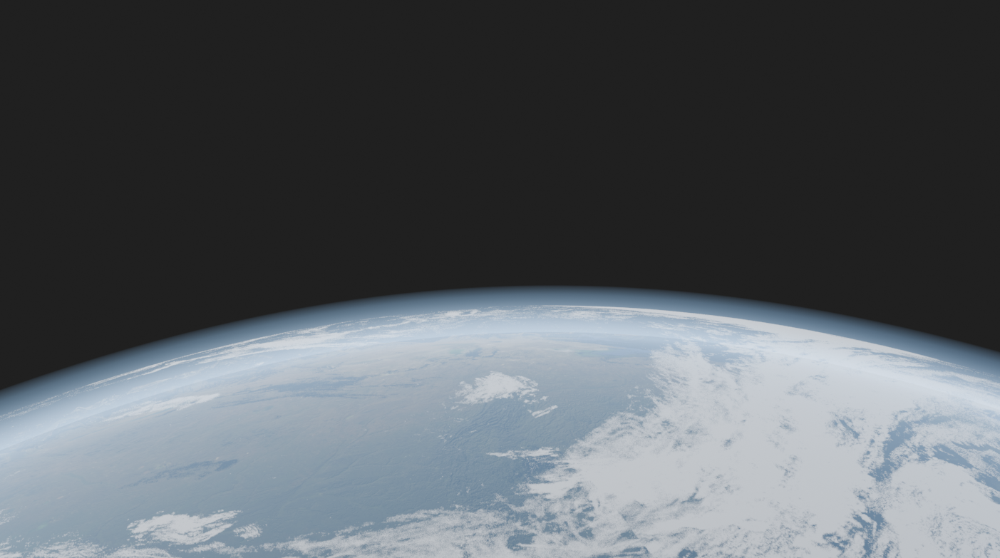
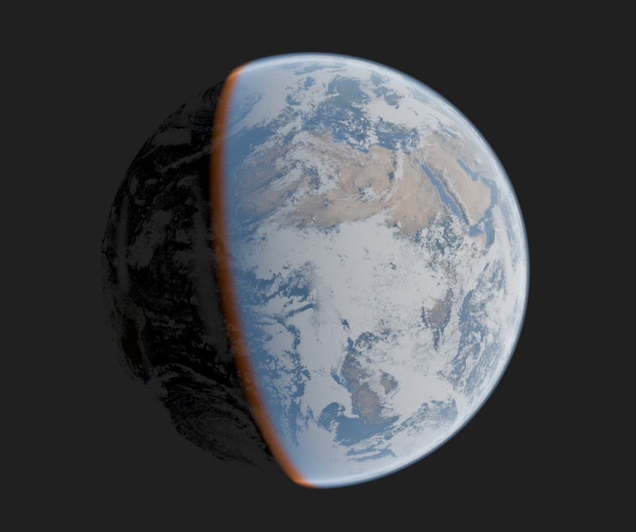
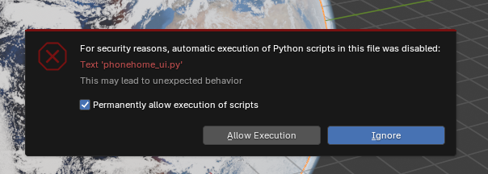

# Project PhoneHome

**A real Earth in Blender, built entirely from NASA data.** Each run downloads (or loads
from an offline tileset) satellite imagery, terrain and *that day's actual cloud cover*,
and builds a lit globe with an atmosphere, all from code in headless Blender.





## How to use

You need [Blender](https://www.blender.org/download/) 4.2 or newer. Nothing else to install.

**1. Get it**

```
git clone https://github.com/cosmic-software/Project-PhoneHome.git
cd Project-PhoneHome
```

**2. Get the tiles** (optional: one ~150 MB download; afterwards it works offline)

```
python -m phonehome.tileset install
```

Skip this step and PhoneHome downloads tiles from NASA as it needs them.

**3a. Render a picture**

```
# Windows
.\run.ps1 --clouds 2026-09-29

# macOS / Linux / anywhere
blender --background --factory-startup --python run_phonehome.py -- --clouds 2026-09-29
```

The result is saved to `output/phonehome_2026-09-29.png`. Run with `--help` for camera, sun,
terrain and atmosphere options.

**3b. …or play with it in Blender**

Open `blender/phonehome.blend` and click **Allow Execution**:



Click the Earth, then open **Object Properties**. The **PhoneHome** panels set terrain
height, switch the oceans between the bathymetric map and a water shader, pick a cloud date
(**Load Clouds**), and tune the clouds and atmosphere.

---

## What it builds

Three spheres, parented to the Earth, 1 Blender unit = 1 km, Earth-fixed axes
(+X through lat 0 / lon 0, +Z north):

| Object | What | Source |
|---|---|---|
| **Earth** | Locked 36 × 18 UV sphere (614 verts), one material per 10° face. Colour plus terrain displacement (Displacement and Bump) | NASA GIBS `BlueMarble_ShadedRelief_Bathymetry`; NASA Visible Earth Blue Marble topography (`gebco_08_rev_elev`, 0–6.4 km) |
| **Clouds** | Shell above the terrain; per-tile cloud masks for a chosen day, shaped by a shared log curve and Color Ramp | NASA GIBS VIIRS true colour (NOAA-20, NOAA-21, SNPP composite) compared against Blue Marble |
| **Atmosphere** | Outer additive shell; limb glow from a Chapman air-column model, coloured by sun angle (night → twilight → day), forward scattering | Shader maths; follows the scene Sun via the shared `Sun Direction` node group |

Every control is a custom property on the Earth object (`terrain_exaggeration`,
`cloud_thin_boost`, `atmosphere_*`), and drivers carry it to all the materials. The
command line sets those properties.

## Command line

Needs Blender 4.2+ (developed on UPBGE 0.50 / Blender 5.0.1), which bundles everything
used here: numpy and OpenImageIO. Nothing needs installing.

```powershell
.\run.ps1 [options]                      # uses $env:BLENDER, or blender on PATH
# or directly:
blender --background --factory-startup --python run_phonehome.py -- [options]
```

`.\run.ps1 --help` lists everything. The main options:

| Option | Default | |
|---|---|---|
| `--clouds YYYY-MM-DD` | yesterday (UTC) | cloud imagery date; VIIRS NOAA-20 from 2018, NOAA-21 from 2023 |
| `--exaggeration` | 20 | terrain height ×; clouds and atmosphere rise with it |
| `--ocean-water` | 0 | oceans: 0 = bathymetric map, 1 = water shader |
| `--ocean-roughness`, `--ocean-colour RRGGBB` | 0.3, deep blue | water shader glint and colour |
| `--sun-lat`, `--sun-lon` | 10, 70 | sub-solar point (where the sun is overhead) |
| `--view-lat`, `--view-lon`, `--view-dist` | 20, 0, 3.5 | camera position (distance in Earth radii) |
| `--cloud-boost` | 4 | thin-cloud log curve: 0 = linear |
| `--atmo-density`, `--atmo-brightness`, `--atmo-thickness-km`, `--atmo-scale-height`, `--atmo-forward-scatter` | 0.08, 0.6, 100, 0.25, 2 | atmosphere look |
| `--engine`, `--samples`, `--resolution` | EEVEE, engine default, 1024 | render settings |
| `--render PATH` / `--no-render` | `output/phonehome_<date>.png` | where to write the PNG |
| `--save-blend PATH` | off | also save the scene as a `.blend` with the control panel |
| `--no-clouds`, `--no-atmosphere` | | skip a shell |
| `--data-dir` | `data/` | download cache location |
| `--offline` | off | never download; everything must come from the installed tileset |

The exit code is 0 on success and 1 on any error, so runs can be scheduled.

## Control panel (`blender/phonehome.blend`)

Open `blender/phonehome.blend` and click **Allow Execution** when Blender asks. Then
select the Earth and look in **Object Properties**:

| Panel | Controls |
|---|---|
| PhoneHome Earth | terrain exaggeration; **Water Shader** slider (0 = bathymetric map, 1 = flat water with sun glint), water colour, water roughness |
| PhoneHome Clouds | Year / Month / Day + **Load Clouds**, the dates available offline, an **Offline (tileset only)** switch, Thin Cloud Boost + Cloud Ramp, show/hide |
| PhoneHome Atmosphere | Sun picker, density / brightness / thickness / scale height / forward scatter, Sky Colour ramp, show/hide |

The panel code is `phonehome/ui.py`. The `.blend` only embeds a small loader that finds
this project folder around the file and registers the panel, so the `.blend` has to stay
inside the project. Image paths are relative to `data/`. Rebuild the file after changing
code or defaults:

```powershell
.\run.ps1 --no-render --save-blend blender\phonehome.blend [same options as a render]
```

## Offline tileset

Pack the tile cache into one zip, then install it on any machine. After that PhoneHome
needs no network. These commands use plain Python, no Blender:

```powershell
python -m phonehome.tileset status                                   # what's cached
python -m phonehome.tileset pack phonehome-tiles.zip --clouds 2026-09-29 [more dates]   # or --all-clouds
python -m phonehome.tileset install                                  # the published tileset
python -m phonehome.tileset install phonehome-tiles.zip              # or your own zip / URL
```

The base tileset (colour + terrain, 1,296 tiles) is ~34 MB, plus ~45 MB per cloud date.
Install checks the manifest and refuses unexpected paths. With `--offline` (CLI), or the
**Offline** switch in the panel, nothing is downloaded. A missing tile or cloud date
fails with a message that names the tileset, instead of reaching for the network.

## Data cache

Everything downloaded is cached under `data/` (git-ignored), so only the first run of a
given date touches the network:

| Path | Size | |
|---|---|---|
| `earth_tiles/` | ~14 MB | 648 GIBS colour tiles |
| `gebco_08_rev_elev_21600x10800.png` | 18 MB | world heightmap (downloaded once) |
| `terrain_tiles/` | ~20 MB | heightmap cut into per-tile PNGs |
| `water_tiles/` | ~3 MB | water masks, made locally from the colour + terrain tiles (no download) |
| `cloud_tiles/YYYY-MM-DD/` | ~45 MB per date | cloud masks; a new date takes about 3 minutes |

## Layout

```
run_phonehome.py        entry point for blender --python
run.ps1                 convenience wrapper
blender/phonehome.blend generated scene + control panel loader
phonehome/
  cli.py                argument parsing, run order
  earth.py              EarthSphere (locked geometry), colour + terrain tiles, materials
  clouds.py             VIIRS cloud masks, cloud shell, Cloud Density node group
  atmosphere.py         atmosphere shell, Sun Direction node group
  scene.py              sun, camera, world, render, optional .blend save
  config.py             paths, constants, tile grid
  net.py                HTTP with retries, GIBS WMS requests
  images.py             OpenImageIO read/write helpers
  drivers.py            driver / custom-property helpers
  ui.py                 control panel (registered by the loader in the .blend)
  tileset.py            offline tileset pack / install / status (plain Python)
```

## Known limits

- Ocean floor isn't displaced (land heightmap only). Peaks above 6.4 km are capped.
- Faint vertical stripes in the clouds where satellite passes meet (haze at the strip edges).
- The atmosphere is built to be seen from outside the shell. A camera inside it sees no sky.
- One camera and one sun, both placed by lat/lon. Mission-driven placement (GMAT ephemeris,
  real sub-solar point from a timestamp) is the natural next step.

## License

Code: MIT, see [LICENSE](LICENSE). Imagery and elevation data come from NASA (GIBS, Visible Earth) and are public domain. The tileset repackages that data.
